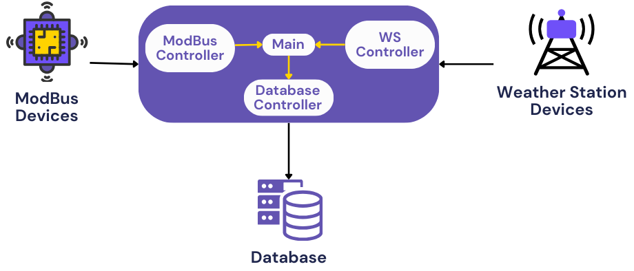
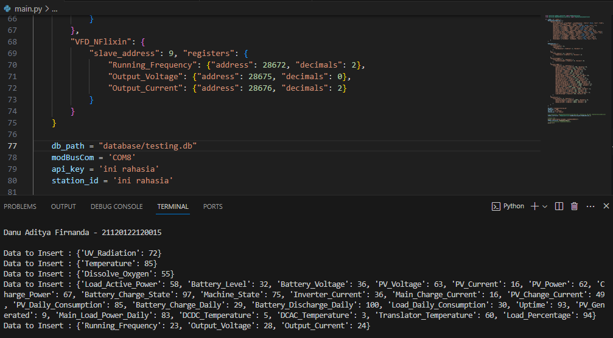
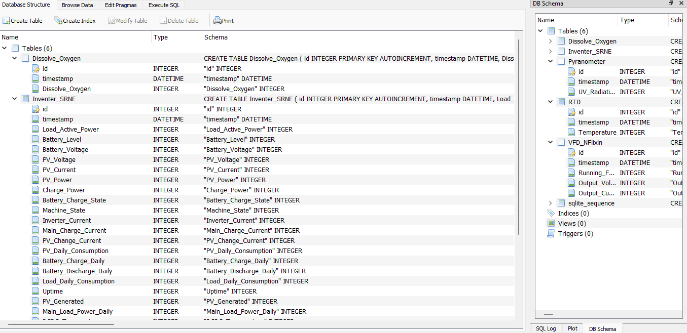

# SOLID Single Responsibility Principle Example Code
Kode dalam repositori ini diambil dari program yang sudah berjalan untuk melakukan monitoring sistem panel surya di Marine Science Techno Park (MSTP) Universitas Diponegoro kampus Jepara. Pada repositori [ini](https://github.com/danuaf/Smart-Solar-Monitoring-System-MSTP-UNDIP)

## Library
Program ini memerlukan beberapa library agar bisa berjalan yaitu
* minimalmodbus
* sqlite3
* Beberapa library standart yang ada dalam python

Berikut hasil running programnya

Data yang didapatkan akan dimasukan ke database lokal (sqlite) untuk nantinya dapat dikirimkan ke database server yang diinginkan. 

## Contributor
* Danu Aditya Firnanda - 21120122120015